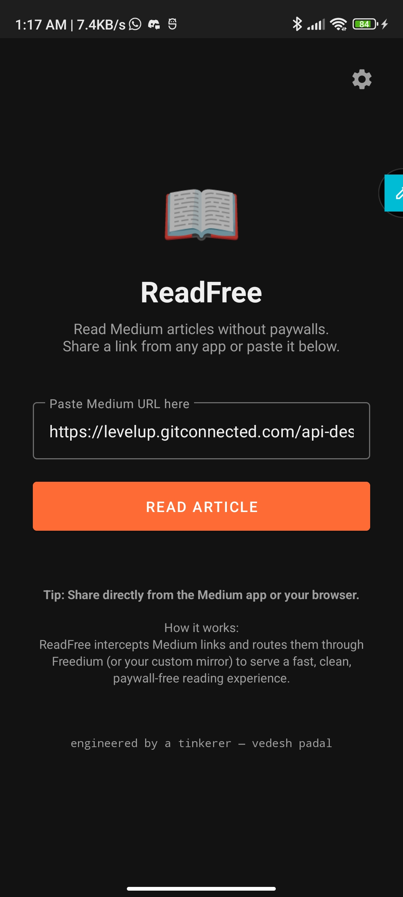
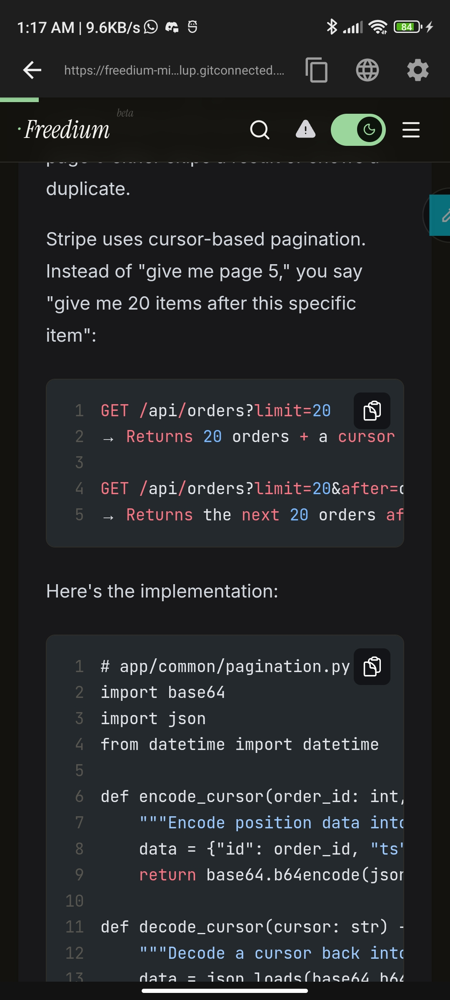

# ReadFree 📖

Bypass the paywall and read Medium articles for free. Share a link from any app or paste it directly, and ReadFree proxies it through a Freedium mirror to serve a fast, clean, ad-free reading experience.

|                             Home Screen                              |                              Reader View                               |
| :------------------------------------------------------------------: | :--------------------------------------------------------------------: |
|  |  |

---

## How it works

1. **Share** a Medium link from any app (Chrome, Medium app, Twitter) → select **ReadFree**.
2. **Or paste** a URL directly on the home screen.

The app intercepts the Medium URL and dynamically routes it through a Freedium-compatible mirror, loading it instantly in an optimized in-app WebView without kicking you out to an external browser.

---

## Features

- **Share-sheet integration** — seamlessly catches links from any app.
- **Dynamic detection** — auto-detects Medium custom domains via URL slugs.
- **In-app WebView reader** — no browser handoff, read directly in the app.
- **Auto-failover** — automatically falls back to alternative mirrors if one is down.
- **Mirror settings** — pick a preset or enter a custom mirror URL.
- **Minimalistic UI** — dark theme, foldable-safe, and lightning-fast.

---

## Download

Grab the latest APK from the [Releases](../../releases) page.

> **Note:** You may need to enable "Install from unknown sources" in your Android settings.

---

## Build locally

Requires JDK 17 and Android SDK.

```bash
chmod +x gradlew
./gradlew assembleDebug
# APK is generated at: app/build/outputs/apk/debug/app-debug.apk
```

---

## Changing the mirror

Tap the **⚙ gear icon** in the reader toolbar → pick a preset or type your own URL → Apply. No rebuild needed.

---

## Requirements

- Android 8.0+ (API 26)
- Internet permission only — no other permissions requested.
